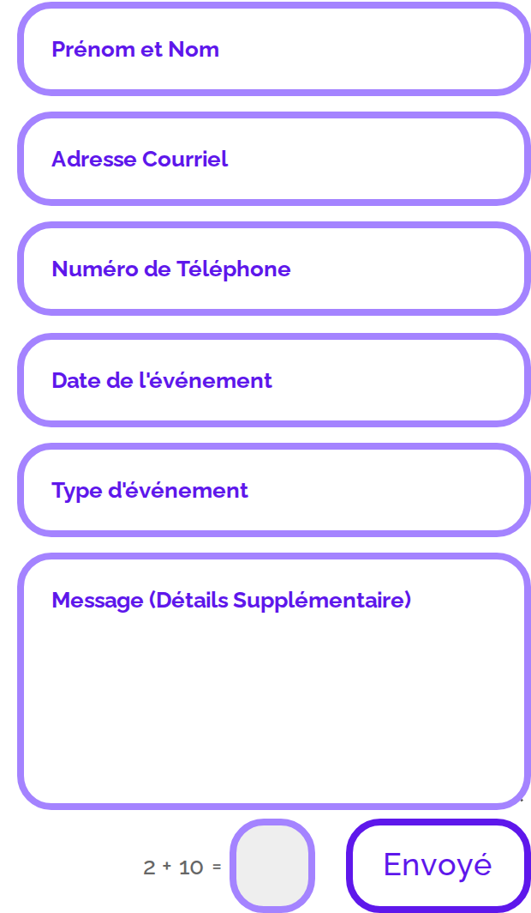
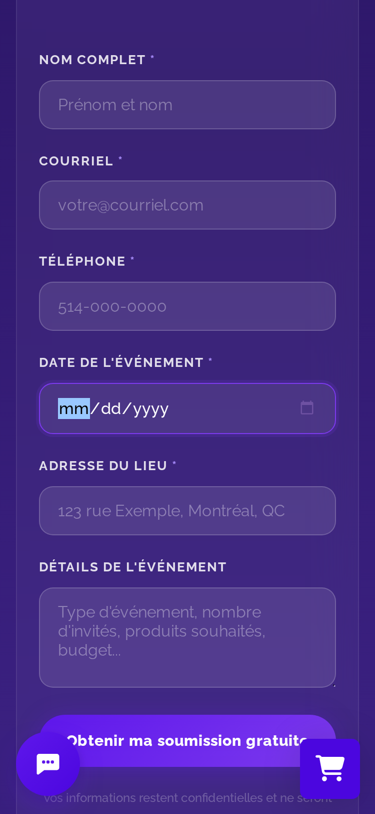
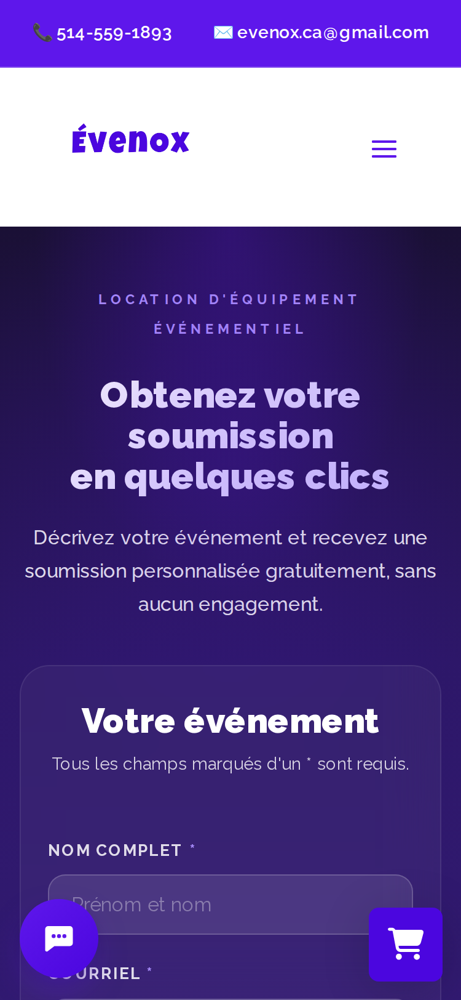
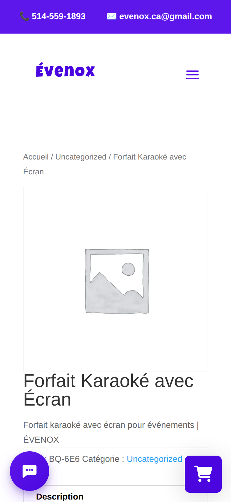

# Le chemin de la demande de soumission — evenox.ca

Relevé effectué le 19 août 2026. Parcours arrêté **avant l'envoi** : aucun champ rempli avec
des données réelles, aucun formulaire soumis, aucun compte créé, aucune donnée personnelle
saisie.

## Comment ce relevé a été fait

- Requêtes espacées d'au moins 2 secondes, une à la fois, jamais en parallèle : 24 requêtes
  directes (`robots.txt`, 3 plans de site, 19 pages HTML, et une vérification de `/merci`), puis
  12 chargements de page dans un navigateur pour les mesures de rendu. Aucun code 403 ni 429
  rencontré ; toutes les réponses sont des 200, sauf `/merci` qui répond 301.
- Analyse du HTML et du JavaScript effectivement servis, hors ligne, après téléchargement.
- Rendu et mesures géométriques dans Chromium 151 (Playwright), fenêtre 375 × 812, densité 2,
  mode tactile, locale `fr-CA`. Les mesures en pixels ci-dessous proviennent de
  `getBoundingClientRect()` et de `getComputedStyle()`, pas d'une estimation à l'œil.
- **Périmètre** : 19 pages examinées — accueil, `/contact/`, `/merci-soumission/`, 3 fiches
  produits, 6 pages corporatives ou sectorielles, la page mariage, le guide de réservation, les
  conditions de location, la livraison corporative, l'événement clé en main et la politique de
  confidentialité. Les plans de site recensent 196 pages et 246 fiches produits. Ce qui suit
  vaut pour les 19 pages examinées ; l'extrapolation au reste du site est **non établie**.

---

## 1. Les points d'entrée

### 1.1 Tableau des points d'entrée relevés

| # | Point d'entrée | Adresse | Aboutit à |
|---|---|---|---|
| 1 | Bouton « Demande de Soumission » de l'en-tête | présent sur toutes les pages examinées | `https://evenox.ca/contact/` |
| 2 | Formulaire intégré à l'accueil (section `#evx-soumission`) | `https://evenox.ca/` | `admin-ajax.php`, action `evx_soumission` |
| 3 | Bouton fixe mobile « 🎯 Obtenir un prix » | `https://evenox.ca/` | ouvre un panneau d'accordéon qui invite à téléphoner |
| 4 | Formulaire des pages corporatives (`#evxForm`) | `/congres-et-conference-corporative/`, `/gala-corporatif/`, `/location-equipement-ecole/`, `/team-building-activitecorpo/` | `hooks.zapier.com/hooks/catch/16509085/us5m7dd/` |
| 5 | Formulaire du guide de réservation (module Divi) | `https://evenox.ca/guide-de-reservation/` | POST vers la page elle-même |
| 6 | Formulaire « demande en mariage » (`#lead-form`) | `https://evenox.ca/demande-en-mariage-soumission-rapide/` | `hooks.zapier.com/hooks/catch/16509085/u1xnrh3/` |
| 7 | Bulle de clavardage (assistant virtuel) | toutes les pages examinées | `evenox-admin-core.base44.app` **et** `n8n-production-43d0.up.railway.app` |
| 8 | Lien courriel pré-rempli | accueil et pied de page | `mailto:evenox.ca@gmail.com?subject=Demande devis Événox` |
| 9 | Lien téléphone | bandeau supérieur, pied de page, panneaux | `tel:+15145591893` |
| 10 | « Réserver en ligne maintenant » | accueil | `https://evenox.booqableshop.com/` — **quitte evenox.ca** |
| 11 | Panier flottant Booqable | toutes les pages examinées | ouvre un panneau latéral de réservation |

### 1.2 Pages corporatives sans formulaire, qui renvoient toutes vers `/contact/`

Sur `/municipalite/`, `/party-noel-corporatif/` et `/forfaits-corporatif/`, il n'y a **aucun
formulaire**. Tous les appels à l'action pointent vers la même page `/contact/`, quel que soit
leur libellé :

- « Soumission Gratuite », « Demander un devis », « Réserver maintenant »,
  « Soumission Gratuite — Festivals 2026 » (page municipalité)
- « Vérifier mes dates de décembre », « Demander ce forfait »,
  « Réserver ma date de décembre », « Vérifier mes dates — dès 1 995 $ » (party de Noël)
- « Écrivez-nous », « Demander une soumission » (forfaits corporatifs)

Aucun de ces libellés ne transmet quoi que ce soit au formulaire d'arrivée. Un visiteur qui
clique « Demander ce forfait » depuis la page party de Noël atterrit sur un formulaire
générique qui ne mentionne ni le forfait, ni décembre, ni le prix de 1 995 $ affiché sur le
bouton. Le champ caché `service` du formulaire de contact est codé en dur à la valeur
`"Page Contact"` — l'origine du clic n'est pas conservée.

### 1.3 Il n'y a pas de formulaire de soumission au bas des fiches produits

Vérifié sur trois fiches (`/product/forfait-reception-100-personnes/`,
`/product/forfait-karaoke-avec-ecran/`, `/product/chiffres-illuminees-40/`). Chacune contient
bien deux `<form>` en bas de page, mais ce sont :

1. un **formulaire d'avis WooCommerce** (`#commentform`) : « Votre note * » (liste à 6 options),
   « Votre avis * », « Nom * », « E-mail * » ;
2. un **champ de recherche** du site.

Le seul chemin de soumission depuis une fiche produit est le bouton de l'en-tête. Il n'existe
aucun bouton « demander un prix pour cet article ».

---

## 2. Les formulaires, champ par champ

Cinq formulaires de soumission distincts coexistent, avec cinq mises en page, cinq jeux de
règles et **trois destinations différentes**. Un client qui compare deux pages du site ne
remplit pas le même formulaire.

### Formulaire A — Accueil (`#evx-form`)

Section « Obtenez votre prix en quelques minutes ». **5 champs visibles**, 11 champs cachés de
traçage (UTM, référent, appareil, horodatage).

| Champ | Type | Étiquette visible | Marqueur obligatoire | Contrôlé à l'envoi |
|---|---|---|---|---|
| `nom_complet` | texte | **aucune** — placeholder « Nom complet » | aucun | oui |
| `email` | courriel | **aucune** — placeholder « Courriel » | aucun | oui (regex simple) |
| `telephone` | tél. | **aucune** — placeholder « Téléphone » | aucun | non |
| `date_event` | texte → date | **aucune** — placeholder « Date de l'événement » | aucun | non |
| `details` | zone de texte | **aucune** — placeholder « Détails supplémentaires (lieu, nombre d'invités, forfait souhaité…) » | aucun | non |

- **Aucun des cinq champs n'a d'étiquette.** Tout repose sur le placeholder, qui disparaît dès
  la première frappe. Le formulaire n'indique nulle part lesquels sont obligatoires.
- Le formulaire porte `novalidate` : la validation du navigateur est désactivée.
- Messages d'erreur : « Veuillez remplir le nom et le courriel. » et « Veuillez entrer un
  courriel valide. » Ils désignent le problème mais ne mettent en évidence aucun champ.
- L'attribut `data-service` de ce formulaire vaut `"Page Contact"` alors qu'il est sur
  l'accueil. Le champ de traçage `service` reçoit donc une valeur fausse.

### Formulaire B — `/contact/` (`#ef-form`)

C'est le point de convergence du parcours : le bouton d'en-tête présent sur les 19 pages
examinées y mène, ainsi que **tous** les appels à l'action des pages corporatives dépourvues de
formulaire (§1.2) et ceux des fiches produits (§1.3). **6 champs visibles.** En-tête :
« Tous les champs marqués d'un * sont requis. »

| Champ | Type | Étiquette | Astérisque | `required` | Réellement contrôlé |
|---|---|---|---|---|---|
| `nom` | texte | « Nom complet » | oui | oui | **oui** |
| `email` | courriel | « Courriel » | oui | oui | **oui** |
| `tel` | tél. | « Téléphone » | oui | oui | **non** |
| `date` | texte → date | « Date de l'événement » | oui | oui | **non** |
| `adresse` | texte | « Adresse du lieu » | oui | oui | **non** |
| `message` | zone de texte | « Détails de l'événement » | non | non | non |

Étiquettes bien présentes et rendues (mesuré : 297 × 24 px chacune). Placeholders utiles
(« Prénom et nom », « votre@courriel.com », « 514-000-0000 », « 123 rue Exemple, Montréal, QC »).
Champs de 297 × 49 px, police 16 px, bouton 297 × 52 px — dimensions correctes.

Trois problèmes de fond, tous vérifiés dans le code servi :

1. **Trois des cinq astérisques ne correspondent à rien.** Le formulaire porte `novalidate`,
   donc le navigateur n'applique pas `required` ; et le script ne vérifie que
   `if (!nom || !isEmail(email))`. Téléphone, date et adresse sont annoncés obligatoires mais
   ne le sont pas.

2. **Les cinq messages d'erreur par champ ne peuvent pas s'afficher.** Le HTML contient
   `#err-nom` « Veuillez entrer votre nom », `#err-email` « Courriel invalide », `#err-tel`
   « Numéro invalide », `#err-date` « Veuillez choisir une date », `#err-adresse` « Veuillez
   entrer l'adresse ». Chacun de ces identifiants n'apparaît **qu'une seule fois** dans toute
   la page : dans le `<div>` lui-même. Aucun script ne les cible. Et la règle
   `.evenox-page .field .field-err { display: none !important; }` les masque avec `!important`,
   ce qui rendrait de toute façon inopérante toute tentative de les afficher en style incorporé.

3. **En cas d'erreur de saisie, le message affiché parle d'une panne.** Le script appelle
   `showFail()`, qui révèle le bloc `#ef-fail` : « Une erreur est survenue. Contactez-nous
   directement : evenox.ca@gmail.com | 514-559-1893 ». C'est le même message que pour une
   panne serveur. Un client qui a simplement tapé son courriel de travers lit qu'il y a eu une
   erreur technique, sans savoir quel champ corriger.

Autres constats :
- L'adresse n'est pas transmise comme champ distinct : le script la concatène en tête du
  message (`'Adresse: ' + adresse + '\n\n' + message`).
- Le contrôle du courriel est très permissif : il vérifie seulement la présence d'un `@` puis
  d'un point placé après. Une chaîne comme `a@b.c` passe.
- En cas de succès, redirection vers `/merci`, qui répond 301 vers `/merci-soumission/`.

### Formulaire C — Pages corporatives (`#evxForm`)

Présent sur `/congres-et-conference-corporative/`, `/gala-corporatif/`,
`/location-equipement-ecole/` et `/team-building-activitecorpo/`. **6 champs, tous obligatoires**,
mention « * Tous les champs sont requis ».

| Champ | Type | Étiquette | Placeholder / exemple |
|---|---|---|---|
| `nom` | texte | « Nom complet * » | aucun |
| `email` | courriel | « Adresse courriel * » | aucun |
| `tel` | tél. | « Numéro de téléphone * » | « Ex. 438-123-4567 » |
| `date` | **`type="date"`** | « Date de l'événement * » | aucun, aucun exemple |
| `adresse` | texte | « Adresse de l'événement * » | « No, rue, ville, code postal » |
| `message` | zone de texte | « Message * » | « Décrivez ce que vous souhaitez louer et vos besoins particuliers. » |

C'est le seul des cinq formulaires dont toutes les obligations sont réellement appliquées : le
script boucle sur les six champs avec `checkValidity()` / `reportValidity()`.

Mesures à 375 px : champs 246 × 68 px, police 18 px, bouton 238 × 84 px, étiquettes toutes
rendues. Dimensions confortables.

Deux problèmes :

1. **La confirmation de succès s'affiche presque quoi qu'il arrive.** La logique est :
   si la réponse est correcte → succès ; sinon → renvoi par un `<iframe>` caché puis succès ;
   et si tout lève une exception → renvoi par `<iframe>` puis succès. La promesse renvoyée par
   ce renvoi de secours se résout sur l'événement `load` de l'iframe, qui survient même quand
   la destination refuse la donnée. Le message « 🎉 Merci! Votre demande a bien été envoyée »
   n'atteste donc pas que la demande soit parvenue à qui que ce soit.

2. **Aucune entreprise n'est demandée.** Sur un formulaire destiné aux congrès, galas et
   écoles, il n'y a ni champ « organisation », ni « nombre de participants », ni « budget »,
   ni « numéro de bon de commande ». Il faut tout écrire dans le champ « Message ».

### Formulaire D — `/demande-en-mariage-soumission-rapide/` (`#lead-form`)

**9 champs visibles** (dont un groupe de 3 boutons radio) plus un champ piège caché. C'est celui
dont la saisie est de loin la mieux guidée du site — et, pour cette raison même, celui dont les
défauts sont les plus regrettables.

| Champ | Type | Étiquette | Astérisque | Aide fournie |
|---|---|---|---|---|
| `website` | texte **caché** | — | — | piège à pourriel, doit rester vide |
| `nom` | texte | « Prénom & nom » | oui | « Ex. Alexandre Séguin » |
| `telephone` | tél. | « Téléphone » | oui | « Ex. 514 555-1234 » |
| `email` | courriel | « Courriel » | oui | « Ex. vous@exemple.com » |
| `ville` | texte | « Ville / région » | non | « Ex. Laval, Rive-Nord, Québec… » |
| `service` | radio ×3 | « Service souhaité » | oui | chaque option a une explication d'une ligne |
| `date` | `type="date"` | « Date envisagée » | non | aucun exemple |
| `message` | zone de texte | « Intention & inspiration » | non | texte d'aide sous le champ |

Les trois options de service sont expliquées, pas seulement nommées : « Package uniquement /
Vous récupérez et retournez le matériel », « Package + livraison & installation / On installe,
vous profitez », « Service clé en main / Direction artistique, décor & mise en scène ». C'est le
seul endroit du site où un client comprend ce qu'il choisit avant de le choisir.

Trois problèmes :

1. **Les données personnelles sont écrites dans l'adresse de la page.** À l'envoi, le script
   construit une chaîne de requête contenant `nom`, `telephone`, `email`, `ville`, `service`,
   `date` et `message`, puis exécute `window.location.search = q.toString()`. Le nom, le numéro
   de téléphone et le courriel du client se retrouvent donc dans la barre d'adresse, dans
   l'historique du navigateur, et dans l'adresse de page transmise aux outils de mesure. Sur
   une page qui affiche « Discrétion uniquement », c'est un écart notable.
2. **Aucune des obligations n'est appliquée.** Le formulaire porte `novalidate` et le
   gestionnaire d'envoi appelle `preventDefault()` sans aucune vérification. Les cinq
   astérisques sont décoratifs.
3. **Le document HTML est imbriqué.** La page contient 2 balises `<html>`, 2 `<body>` et
   5 `<head>` : un document complet a été collé dans le contenu de la page WordPress.

### Formulaire E — `/guide-de-reservation/` (module Divi)

**7 champs**, dont un captcha arithmétique. C'est le formulaire le plus hostile du site.

| Champ | Étiquette rendue à l'écran | Obligatoire (`data-required_mark`) |
|---|---|---|
| Prénom et Nom | **non — `display:none`** | oui |
| Adresse Courriel | **non — `display:none`** | oui |
| Numéro de Téléphone | **non — `display:none`** | oui |
| Date de l'événement | **non — `display:none`** | oui |
| Type d'événement | **non — `display:none`** | oui |
| Message (Détails Supplémentaire) | **non — `display:none`** | oui |
| Captcha (« 8 + 14 = », « 2 + 10 = »… — l'opération change à chaque chargement) | aucune étiquette du tout | oui |

Mesuré à 375 px : les six `<label>` ont `display: none` et une hauteur de 0 px. Il ne reste que
les placeholders, qui disparaissent à la première frappe. **Aucun astérisque, aucune mention
« champs requis » nulle part**, alors que les sept champs le sont.

Autres constats mesurés :
- Police des champs : **13 px**. Sous 16 px, Safari iOS agrandit la page au moment de la mise
  au point sur un champ.
- Champ captcha : 50 × 55 px, aucune explication de sa raison d'être.
- **Le bouton d'envoi porte le mot « Envoyé »** — participe passé. Il annonce l'action comme
  déjà accomplie avant même qu'on y touche.



### Formulaire F — Bas des fiches produits (avis WooCommerce)

Ce n'est pas un formulaire de soumission, mais c'est ce qu'un visiteur trouve s'il descend au
bas d'une fiche produit en cherchant à poser une question. 5 champs : « Votre note * » (liste :
Évaluation… / Parfait / Bon / Moyen / Pas mal / Très mauvais), « Votre avis * », « Nom * »,
« E-mail * », bouton d'envoi. Mention « Votre adresse e-mail ne sera pas publiée. Les champs
obligatoires sont indiqués avec * ».

### 2.1 Le champ date, dans les cinq formulaires

C'est le champ le plus incohérent du parcours.

| Formulaire | Type initial | Indication affichée dans le champ | Comportement |
|---|---|---|---|
| A — accueil | `text` | « Date de l'événement » — pas un exemple | bascule en `date` à la mise au point |
| B — contact | `text` | **« Ex: 15 juin 2026 »** — un exemple, mais inapplicable | bascule en `date` à la mise au point ; `min` = date du jour |
| C — corporatif | `date` | rien | sélecteur natif dès l'affichage, aucun exemple |
| D — mariage | `date` | rien | sélecteur natif dès l'affichage, aucun exemple |
| E — guide | `text` | « Date de l'événement » — pas un exemple | reste un champ texte libre : aucun format imposé, aucun format suggéré |

Sur le formulaire de contact, le placeholder annonce **« Ex: 15 juin 2026 »**, mais dès que le
client touche le champ, celui-ci devient un `<input type="date">`, c'est-à-dire un sélecteur
segmenté dans lequel il est **impossible de saisir « 15 juin 2026 »**. L'exemple donné ne peut
jamais être suivi. Le champ passe aussi de 49 à 51 px de haut à cet instant, ce qui décale
légèrement la mise en page.

Le format réellement affiché dans le sélecteur est choisi par le navigateur du visiteur, pas
par le site. Dans l'environnement de test (Chromium 151 sans interface, locale `fr-CA`
demandée), il s'affiche **`mm/dd/yyyy`** — ordre mois/jour/année, abrégé en anglais. Un test
hors ligne sur une page locale donne le même résultat avec `--lang=fr-CA`, ce qui indique une
limite de ce navigateur de test. **Ce que voient réellement les visiteurs québécois est donc
non établi** ; ce qui est établi, c'est que le site propose un exemple que son propre champ
n'accepte pas.



---

## 3. Ce qui ferait abandonner, du plus coûteux au plus bénin

### 3.1 — Sur mobile, le bouton « Obtenir un prix » de l'accueil est invisible et intouchable

Deux défauts cumulés sur le même élément, tous deux mesurés.

**Il ne s'affiche pas dans la bonne couleur.** Sa règle CSS contient deux déclarations
invalides :

```css
background: #5e17eb, ;   /* virgule finale : déclaration rejetée */
color: ##5e17eb;         /* double dièse : déclaration rejetée */
```

Le navigateur les écarte toutes les deux. Valeurs calculées effectivement relevées :
`background-color: rgb(239, 239, 239)` (le gris par défaut d'un bouton système) et
`color: rgb(0, 0, 0)`. Il ne subsiste du violet que l'ombre portée.

**Il est recouvert par le contenu de la page.** Le bouton est en `position: fixed` avec
`z-index: 9999`, mais il est placé dans une colonne Divi en `position: relative; z-index: 2`,
qui forme un contexte d'empilement : son 9999 ne vaut qu'à l'intérieur de cette colonne.
Test de pointage (`elementFromPoint` au centre du bouton) sur 11 positions de défilement de
l'accueil :

| Défilement | Élément réellement au centre du bouton | Touchable |
|---|---|---|
| 0 %, 10 %, 20 %, 30 %, 60 % | `button.evx-sticky-btn` | oui |
| 40 % | `div.et_pb_module.et_pb_cta_5` | **non** |
| 50 % | `div.et_pb_testimonial_portrait` | **non** |
| 70 % | `img.wp-image-3762` | **non** |
| 80 % | `h3` | **non** |
| 90 % | `p` | **non** |
| 100 % | `a` | **non** |

Touchable à 5 positions sur 11. À partir de 70 % de la page et jusqu'en bas — exactement là où
se trouve le visiteur qui a tout lu et qui est décidé — il ne répond plus. La capture de
l'élément à sa propre position ne montre que la photo qui se trouve derrière.

Enfin, il mesure **150 × 40 px** : 40 px de hauteur, sous le seuil de 44 px habituellement
retenu pour une cible tactile.

### 3.2 — Sur mobile, le bouton « Demande de Soumission » de l'en-tête est replié dans le menu

À 1280 px, le bouton est visible dans l'en-tête et mesure 257 × 76 px. À 375 px, les deux
occurrences du lien sont masquées par un ancêtre en `display: none` (`et_pb_menu__menu` et
`mobile_menu1`) : il faut d'abord ouvrir le menu hamburger. Combiné au point 3.1, il ne reste
sur l'accueil mobile **aucun accès direct et fiable** au parcours de soumission : le bouton
d'en-tête est replié, et le bouton fixe est gris et souvent intouchable.

### 3.3 — Une erreur de frappe déclenche un message de panne serveur

Sur `/contact/`, le point de convergence de tout le parcours, une adresse courriel mal tapée affiche
« Une erreur est survenue. Contactez-nous directement : … ». Le client ne sait pas quel champ
corriger ; il croit que le site est en panne. Les cinq messages précis rédigés pour cela
existent dans le HTML mais sont rendus impossibles à afficher par `display: none !important` et
ne sont référencés par aucun script. Voir §2, formulaire B.

### 3.4 — Le succès est annoncé sans preuve d'envoi

Deux formulaires affichent une confirmation qui ne prouve rien :

- **Formulaire C (corporatif, 4 pages)** : « 🎉 Merci! Votre demande a bien été envoyée » est
  affiché sur la branche nominale, sur la branche de repli, et dans le bloc de rattrapage
  d'exception. Voir §2, formulaire C.
- **Formulaire D (mariage)** : l'envoi se fait en `mode: 'no-cors'`, ce qui rend la réponse
  illisible par construction ; le script bascule ensuite vers l'écran de remerciement sans
  jamais avoir pu vérifier quoi que ce soit.

Ce sont les deux formulaires branchés sur Zapier. Ni l'un ni l'autre n'appelle
`admin-ajax.php` : rien n'est transmis à WordPress, et il ne reste donc, côté site, aucune trace
de la demande. Un client qui a vu « Merci » n'a aucune raison de relancer.

### 3.5 — Sur le guide de réservation : sept champs obligatoires, zéro étiquette, un captcha

Six étiquettes en `display: none`, aucun astérisque, aucune mention que quoi que ce soit est
requis, une police de 13 px qui provoque l'agrandissement automatique sur iOS, un captcha
arithmétique sans explication, et un bouton qui dit « Envoyé » avant l'envoi. Un client qui
commence à remplir perd le nom de chaque champ dès la première frappe.

### 3.6 — Les données personnelles du formulaire mariage passent par l'adresse de la page

Nom, téléphone, courriel et message écrits en clair dans la chaîne de requête, donc dans la
barre d'adresse et dans l'historique. Sur une page qui promet « Discrétion uniquement ».
Voir §2, formulaire D.

### 3.7 — On demande une date ferme et une adresse de lieu avant de donner le moindre prix

| Formulaire | Adresse du lieu | Date de l'événement |
|---|---|---|
| A — accueil | pas de champ (suggérée dans le placeholder du message) | champ présent, non obligatoire |
| B — contact | « Adresse du lieu * » — annoncée obligatoire, **non appliquée** | annoncée obligatoire, **non appliquée** |
| C — corporatif | « Adresse de l'événement * » — **obligatoire et appliquée** | **obligatoire et appliquée** |
| D — mariage | « Ville / région », facultative | « Date envisagée », facultative |
| E — guide | pas de champ | annoncée obligatoire par l'attribut Divi |

Ce sont des questions auxquelles un client ne peut répondre que s'il a déjà réservé sa salle et
arrêté son calendrier — c'est-à-dire après avoir comparé les prix, pas avant. Sur le formulaire
C, celui des congrès, galas, écoles et activités d'équipe, il n'existe **aucun moyen d'envoyer
une demande exploratoire** : les six champs sont réellement bloquants, et l'adresse comme la
date en font partie. Un responsable qui magasine trois fournisseurs avant de retenir une salle
ne peut pas remplir ce formulaire.

À l'inverse, le formulaire D (mariage) laisse la date et la ville facultatives, et c'est le seul
qui explique ce qu'il vend avant de demander quoi que ce soit.

### 3.8 — L'origine du clic n'est jamais transmise

Un visiteur qui clique « Vérifier mes dates — dès 1 995 $ » sur la page party de Noël, ou
« Demander ce forfait », atterrit sur un formulaire générique où rien ne rappelle ce qu'il
demandait. Le champ `service` est codé en dur à `"Page Contact"`. Sur l'accueil, le même champ
reçoit également `"Page Contact"` à cause d'un `data-service` recopié. L'équipe qui reçoit la
demande ne sait pas d'où elle vient ; le client doit tout réécrire dans la zone de texte.

### 3.9 — Le délai de réponse annoncé change d'une page à l'autre

Trois promesses distinctes, réparties sur cinq emplacements, toutes relevées dans le HTML servi :

| Emplacement | Ce qui est promis |
|---|---|
| Accueil, colonne de gauche du formulaire | « ⏰ Réponse en moins de 2 heures » |
| Accueil, écran de confirmation | « ⏱ Réponse en moins de 2 heures » + « vous contactera sous peu » |
| `/contact/`, encadré de statistiques | « **24h** Temps de réponse » |
| `/demande-en-mariage-soumission-rapide/` | « Retour en 24 h » |
| `/merci-soumission/` | « dans les plus brefs délais » |

Le bouton d'en-tête mène précisément à la page qui annonce le délai le plus long. Un client
attiré par « moins de 2 heures » sur l'accueil lit « 24h » sur le formulaire qu'on lui demande
de remplir.

### 3.10 — Trois éléments flottants occupent le bas de l'écran mobile

Mesuré à 375 px sur l'accueil :

| Élément | Position | Taille |
|---|---|---|
| Bulle de clavardage | x 16 → 80, y 730 → 794 | 64 × 64 px |
| Bouton « 🎯 Obtenir un prix » | x 113 → 263, y 756 → 796 | 150 × 40 px |
| Panier Booqable | x 300 → 360, y 737 → 797 | 60 × 60 px |

Ils ne se chevauchent pas entre eux, mais ils occupent ensemble une bande de 67 px sur toute la
largeur, en permanence, par-dessus le contenu. Sur `/contact/`, la bulle de clavardage et le
panier recouvrent le bas du formulaire de soumission lui-même : sur la capture ci-dessous, le
panier masque une partie de l'étiquette « COURRIEL * ».



### 3.11 — Le résumé du panier Booqable déborde de 185 px

Sur les cinq pages mesurées à 375 px, l'élément `#booqable-launcher-summary` a
`opacity: 1`, `visibility: visible`, `display: inline-block`, commence à x = 300 et fait 260 px
de large : son bord droit tombe à **x = 560 sur une fenêtre de 375 px**, soit 185 px hors
écran. Le document lui-même ne défile pas horizontalement (`scrollWidth` = 375), donc le
contenu est simplement coupé.

### 3.12 — La police de 14,4 px du formulaire d'accueil provoque un agrandissement sur iOS

Champs du formulaire A mesurés à 375 px : 271 × 51 px, police **14,4 px**. En dessous de 16 px,
Safari iOS agrandit automatiquement la page à la mise au point. Le formulaire B (`/contact/`)
utilise 16 px et n'a pas ce défaut ; le formulaire E est à 13 px et l'a aussi.

### 3.13 — Les champs du formulaire mariage font 36,5 px de haut

Mesuré à 375 px : `nom`, `telephone`, `email` et `ville` font 206 × 36,5 px. Sous le seuil de
44 px.

### 3.14 — Les liens du pied de page font 16 à 19 px de haut

Mesuré à 375 px sur `/contact/` et sur la page mariage : « Contact » 56 × 16 px, « Blogue »
51 × 16 px, « Politique de confidentialité » 189 × 16 px, « À Propos » 60 × 16 px, ainsi que le
téléphone (113 × 16 px) et le courriel (176 × 16 px) du bandeau supérieur. Tous très en dessous
de 44 px de hauteur.

### 3.15 — Le lien de l'adresse postale pointe vers une redirection Bing

Dans le pied de page, « 215 Boulevard René-A.-Robert, Sainte-Thérèse… » (272 × 39,8 px) pointe
vers une adresse `https://www.bing.com/ck/a?!&&p=…` — une URL de redirection de moteur de
recherche collée telle quelle, au lieu d'un lien de carte.

### 3.16 — Trois destinataires de données ne figurent pas dans la politique de confidentialité

La politique (mise à jour du 11 août 2026) énumère : Booqable, Google, OpenAI, Mailchimp,
Intuit QuickBooks, Stripe. Elle indique par ailleurs qu'elle s'applique « à nos formulaires de
demande de soumission ».

Or les formulaires envoient aussi vers :

| Destination | Ce qui y transite | Nommée dans la politique |
|---|---|---|
| `hooks.zapier.com` (deux crochets distincts) | nom, courriel, téléphone, date, adresse, message | **non** |
| `evenox-admin-core.base44.app` | messages du clavardage, identifiant de visiteur | **non** |
| `n8n-production-43d0.up.railway.app` | messages du clavardage, identifiant de visiteur, adresse de page | **non** |

Le formulaire de contact affiche « Vos informations restent confidentielles et ne seront jamais
partagées. » ; celui de l'accueil affiche « Vos informations restent confidentielles ». La page
mariage annonce un « lien Calendly » après l'envoi ; Calendly n'est pas nommé non plus. Ce
relevé se borne à constater l'écart entre la liste publiée et les destinations observées dans le
code ; son appréciation juridique n'en fait pas partie.

### 3.17 — Le bouton d'envoi du guide de réservation dit « Envoyé »

Participe passé au lieu de l'infinitif. L'action est annoncée comme accomplie avant d'être faite.

### 3.18 — Le clavardage n'annonce ni son délai ni sa destination

La bulle affiche « Chattez avec nous 👋 », l'en-tête « En ligne », et le premier message
« Bonjour! 👋 Je suis l'assistant virtuel d'Évenox. » Rien n'indique s'il y a un humain
derrière, ni sous combien de temps. Un bandeau « 💬 Un conseiller Évenox vous répond » n'apparaît
qu'après bascule côté serveur. En cas de coupure, le seul message est « Connexion interrompue,
réessayez. »

---

## 4. Ce que le client sait — et ne sait pas — au moment d'envoyer

### 4.1 Le prix : il ne le sait pas

- **Les fiches produits n'affichent aucun prix.** Vérifié sur trois fiches, en HTML et après
  rendu complet dans le navigateur. Sur `/product/forfait-karaoke-avec-ecran/` : aucune photo
  (image de remplacement), catégorie « Uncategorized », description qui répète le titre de
  référencement, **aucun prix, aucun bouton d'ajout au panier**. Le seul montant présent dans le
  document est « $10.00 », porté par un élément de classe `price` qui n'apparaît **pas** dans le
  texte visible de la page (le relevé de tous les montants du texte affiché revient vide). Ce à
  quoi ce « $10.00 » se rapporte est **non établi**.
- **Aucun des cinq formulaires n'affiche de fourchette, de tarif minimum ni de barème.**
- Les seuls montants rencontrés sur le parcours sont des accroches de page : « dès 1 995 $ » sur
  un bouton de la page party de Noël. Ce que ce montant couvre est **non établi**.



### 4.2 Le délai : on le lui dit, mais pas la même chose selon la page

Voir §3.9. Entre « moins de 2 heures », « 24h » et « dans les plus brefs délais », le client ne
peut pas savoir lequel s'applique à lui. Aucun de ces cinq emplacements n'associe d'horaire
ouvrable au délai annoncé, alors que l'accueil précise par ailleurs, dans un panneau distinct :
« Disponibilités : lun–ven 12h–18h, sam–dim 9h–13h ». Une demande envoyée le vendredi soir n'a
donc pas de réponse annoncée.

### 4.3 L'engagement : il est rassuré, sans que ce soit détaillé

Le mot « sans engagement » est bien présent :

- Accueil : « Gratuit • Sans engagement • Réponse rapide »
- `/contact/` : « recevez une soumission personnalisée gratuitement, sans aucun engagement » et
  « Soumission gratuite et sans engagement »
- Page mariage : « Sans prix affiché • 100% personnalisé »

En revanche, **aucun formulaire ne renvoie vers les conditions de location ni vers la politique
de confidentialité**, et aucun ne comporte de case de consentement. Le client accepte sans être
invité à lire quoi que ce soit.

### 4.4 Ce qui l'attend ensuite : cela dépend du formulaire

- **`/contact/`** est le seul à l'expliquer, en trois étapes : « Décrivez votre événement » →
  « Recevez votre soumission » (« Notre équipe prépare un prix détaillé adapté à vos besoins »)
  → « Confirmez et célébrez ». Il affiche aussi « 24h Temps de réponse » et « 500+ Événements
  réalisés ». Le fondement de ce chiffre de 500 est **non établi**.
- **Page mariage** : la plus explicite avant l'envoi — « 3 minutes à compléter », « Retour en
  24 h », « Discrétion uniquement », « Après l'envoi : courriel + lien Calendly ».
- **Accueil, pages corporatives, guide de réservation** : rien avant l'envoi. Le client apprend
  après coup qu'« une soumission détaillée » suivra.

### 4.5 Ce qu'il ne trouve nulle part sur le chemin de la soumission

- Ce que coûte la livraison, l'installation ou le ramassage. L'accueil mentionne, dans un
  panneau d'accordéon distinct du formulaire, des plages horaires — « Ramassage (tous les
  jours) : 8h–10h • 17h–19h », « Livraison : 13h–17h », « Tarification : même prix jusqu'à 48 h
  (1–2 jours) », « Préparation : 1 heure minimum » — mais aucun montant.
- Le dépôt exigé. Le seul endroit où il apparaît est une donnée structurée invisible à l'écran,
  au bas de `/guide-de-reservation/` : « payez le dépôt de 20 % de la valeur de la location. Il
  n'est pas remboursable en argent, mais il vous est crédité pendant 12 mois si vous annulez ».
  Cette information concerne la réservation en ligne, pas la soumission, et n'apparaît sur aucun
  des cinq formulaires.
- La zone desservie et ce qui se passe au-delà. L'accueil indique « Rive-Nord, Laval, Montréal &
  environs » à côté du formulaire ; aucune limite chiffrée n'est donnée.
- La durée de conservation de sa demande. La politique de confidentialité l'indique — « trois
  ans » pour une demande sans suite — mais aucun formulaire n'y renvoie.

### 4.6 En résumé

Le client envoie **son nom, son courriel, son téléphone, la date et l'adresse de son
événement** — et sur les formulaires corporatifs il ne peut pas faire autrement — en échange
d'une seule chose vérifiable : la promesse qu'on le rappellera. Il ne connaît ni le prix, ni un
ordre de grandeur, ni le dépôt, ni le coût de livraison, et le délai qu'on lui a annoncé varie
d'un facteur douze selon la page par laquelle il est passé. Sur les quatre pages corporatives et
sur la page mariage, il ne peut même pas être certain que sa demande soit partie.

---

## 5. Le parcours refait à 375 px

Toutes les valeurs ci-dessous sont mesurées, pas estimées.

### 5.1 Ce qui déborde

Cinq pages mesurées : accueil, `/contact/`, `/gala-corporatif/`, `/guide-de-reservation/`,
`/demande-en-mariage-soumission-rapide/`. Les cinq donnent **exactement le même résultat** :
six éléments qui débordent, tous appartenant au panneau du panier Booqable, et rien d'autre.

| Élément | Position | Débordement |
|---|---|---|
| `#booqable-launcher-summary` | x = 300, largeur 260 | **185 px** hors écran |
| `.bq-dates` | x = 315, largeur 230 | 170 px |
| `.bq-summary` | x = 315, largeur 230 | 170 px |
| `<hr>` du panneau Booqable | x = 315, largeur 230 | 170 px |
| deux `<span>` du même panneau | x = 315 | 147 px et 55 px |

À porter au crédit du site : **aucune des cinq pages ne défile horizontalement** et **aucun
élément propre à Évenox ne déborde** — `scrollWidth` reste à 375 px partout. Le seul contenu
coupé appartient au module tiers de réservation.

### 5.2 Ce qui se chevauche

- Sur les cinq pages mesurées et sur la fiche produit rendue : la bulle de clavardage (64 × 64,
  coin inférieur gauche) et le panier Booqable (60 × 60, coin inférieur droit) recouvrent en
  permanence le contenu situé sous eux. Sur `/contact/`, ils recouvrent le bas du formulaire de
  soumission ; sur la fiche produit, la bulle recouvre la ligne « UGS : BQ-6E6 ».
- Sur l'accueil, le bouton « 🎯 Obtenir un prix » est lui-même recouvert par le contenu de la
  page à 6 des 11 positions de défilement testées (voir §3.1).

### 5.3 Ce qui devient impossible à toucher

| Élément | Taille mesurée | Sous le seuil de 44 px |
|---|---|---|
| Bouton « 🎯 Obtenir un prix » (accueil) | 150 × **40** px | oui, en hauteur — et intouchable 6 fois sur 11 |
| Champs du formulaire mariage (`nom`, `telephone`, `email`, `ville`) | 206 × **36,5** px | oui |
| Liens du menu de pied de page | 51–204 × **16 à 19** px | oui |
| Téléphone du bandeau supérieur | 113 × **16** px | oui |
| Courriel du bandeau supérieur | 176 × **16** px | oui |
| Lien d'adresse postale (pied de page) | 272 × **39,8** px | oui |
| Bouton « Demande de Soumission » de l'en-tête | **0 × 0** — replié dans le hamburger | inatteignable sans ouvrir le menu |

### 5.4 Les cibles correctement dimensionnées

Pour être juste, une bonne partie du parcours tient la route sur téléphone :

| Élément | Taille mesurée |
|---|---|
| Champs du formulaire `/contact/` | 297 × 49 px, police 16 px |
| Bouton « Obtenir ma soumission gratuite » | 297 × 52 px |
| Champs du formulaire corporatif | 246 × 68 px, police 18 px |
| Bouton « Envoyer la demande » (corporatif) | 238 × 84 px |
| Champs du formulaire d'accueil | 271 × 51 px (mais police 14,4 px) |
| Champs du guide de réservation | 300 × 55 px (mais police 13 px) |
| Bulle de clavardage | 64 × 64 px |
| Panier Booqable | 60 × 60 px |

### 5.5 Police des champs et agrandissement iOS

| Formulaire | Police | Agrandissement automatique sur iOS |
|---|---|---|
| C — corporatif | 18 px | non |
| D — mariage | 17,9 px | non |
| B — `/contact/` | 16 px | non |
| A — accueil | **14,4 px** | oui |
| E — guide de réservation | **13 px** | oui |

---

## 6. Ce qui n'a pas été fait

- **Aucun formulaire n'a été envoyé.** Aucun champ n'a reçu de nom, de courriel, de téléphone,
  d'adresse ou de date. Le seul geste posé sur un champ a été de **placer le curseur** dans le
  champ date de `/contact/` pour observer sa bascule de `text` vers `date` — geste purement
  local, sans requête réseau ni transmission de donnée.
- Le clavardage n'a pas été ouvert et aucun message n'y a été écrit : son comportement est
  décrit à partir de son code, pas d'une conversation.
- `evenox.booqableshop.com` n'a pas été visité : c'est un autre domaine, et le parcours de
  réservation en ligne sort du périmètre demandé.
- Aucun compte, aucune commande, aucun devis n'a été créé. Rien n'a été modifié sur le site.

## 7. Ce qui reste non établi

- Le format de date réellement affiché aux visiteurs québécois dans le sélecteur natif
  (§2.1) : le navigateur de test n'est pas concluant sur ce point.
- Ce que devient une demande une fois arrivée chez Zapier ou n8n, et si elle parvient à
  quelqu'un. Seul l'envoi côté client a été observé.
- Le comportement réel des formulaires côté serveur : validation, message de refus, sort d'une
  demande incomplète. Cela exigerait un envoi, qui n'a pas été fait.
- Le taux d'abandon, le volume de demandes, le délai de réponse effectif : aucune donnée.
- Si les 5 formulaires relevés sont les seuls du site. 19 pages ont été examinées sur les 442
  recensées par les plans de site (196 pages + 246 fiches produits).
- Le fondement du chiffre « 500+ Événements réalisés », du « dès 1 995 $ », et de tout autre
  chiffre commercial affiché.
- Ce que couvre le dépôt de 20 % dans le cas d'une soumission (par opposition à une réservation
  en ligne).
